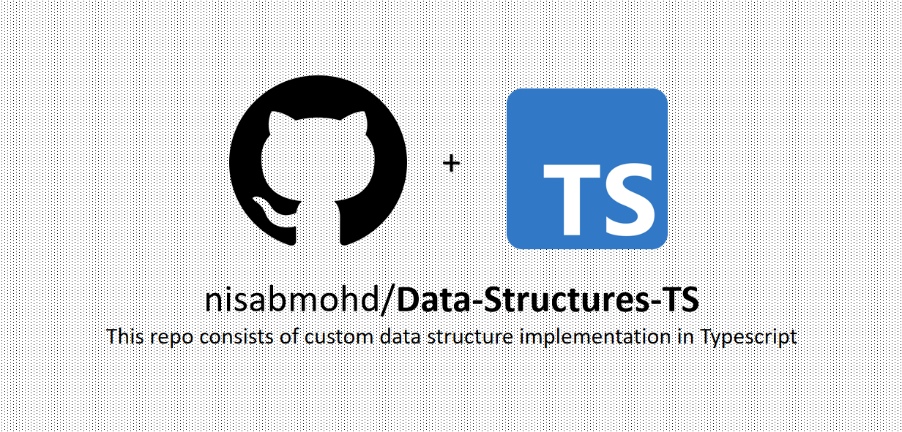

# Data Structure Implementations in Typescript
 We know how data structure plays an important role in interview preparation as well for problem solving.

Usually we use internal data structures and we don’t know how things are working behind. Using a data structure without knowing its working its useless. This data structure implementation are asked in interview and if you know how to implement a data structure you can design your own custom data structure according to your needs.

So you understood that data structure implementation will not only help you in interview but also can be used in development for creating custom structures. So from where we need to learn this?

I have made this GitHub repository containing all the internal collection framework of Java plus Data structures needed in daily life. Below is the list of Data structures in my GitHub repo .

